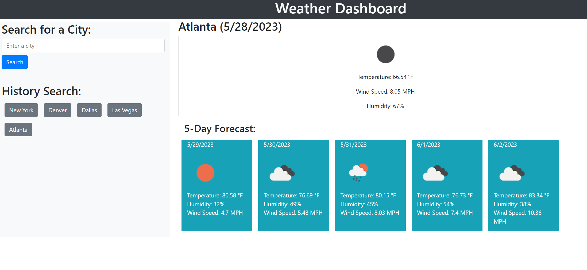

# Weather Dashboard

### Deployment: Click [here](weather-dashboard-8dtn36wyv-yul402.vercel.app) to go to the weather dashboard. 

## Description
A simple web-based application that can be used to get current and future 5 days' weather condition, such as "Temperature", "Humidity" and "Wind Speed". Cities that users previously looked up will be saved and can be accessible in "History Search" section. Data used in this dashboard is get from ["Open Weather"](https://openweathermap.org/)

## User Story
```
- AS A traveler
- I WANT to see the weather outlook for multiple cities
- SO THAT I can plan a trip accordingly
```

## Acceptance Criteria
```
GIVEN a weather dashboard with form inputs
WHEN I search for a city
THEN I am presented with current and future conditions for that city and that city is added to the search history
WHEN I view current weather conditions for that city
THEN I am presented with the city name, the date, an icon representation of weather conditions, the temperature, the humidity, and the the wind speed
WHEN I view future weather conditions for that city
THEN I am presented with a 5-day forecast that displays the date, an icon representation of weather conditions, the temperature, the wind speed, and the humidity
WHEN I click on a city in the search history
THEN I am again presented with current and future conditions for that city
```

## Demonstration


